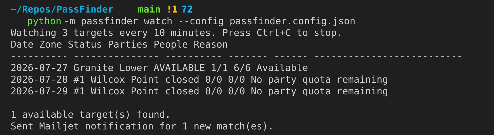
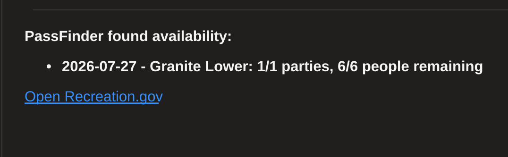

# PassFinder

PassFinder watches Recreation.gov permit availability for the exact dates, zones, and group size you care about, then alerts you when a matching opening appears.

It is a local Python CLI tool built for high-demand permits where the official release window is not the only chance to get outside. Save your trip criteria in `passfinder.config.json`, run a one-time check or continuous watcher, and optionally receive email alerts when cancellations create a new opportunity.

PassFinder only monitors availability and links you to Recreation.gov. It does not log in, reserve permits, or automate checkout.

## Background

PassFinder started with a real trip problem: my best friend and I were planning a backpacking route through Grand Teton National Park, but the advance backcountry permits were gone before we could reserve the itinerary we wanted.

That left us with the usual backup plan: keep checking Recreation.gov, hope someone cancels, or gamble on walk-up permits after we were already committed to the trip. None of those options were especially reassuring when the route depended on specific camp zones lining up across multiple nights.

So I built PassFinder to turn that anxious refresh loop into a focused watchlist. Instead of manually checking every date and camp area, PassFinder monitors the targets that would actually make the trip work and sends an alert when Recreation.gov reports enough remaining quota. It keeps the final booking step in your hands, but helps you notice the narrow window when a canceled permit becomes available.

## Requirements

- Python 3.10 or newer
- Internet access for Recreation.gov availability checks
- A Mailjet account if you want email alerts
- A verified Mailjet sender address

No third-party Python packages are required.

## Setup

1. Create and activate a virtual environment:

```sh
python3 -m venv .venv
source .venv/bin/activate
```

2. Create your local environment file:

```sh
cp .env.example .env
```

3. Edit `.env` with your Mailjet values:

```sh
MAILJET_API_KEY=your-mailjet-api-key
MAILJET_API_SECRET=your-mailjet-api-secret
MAILJET_FROM_EMAIL=sender@example.com
MAILJET_FROM_NAME=PassFinder
MAILJET_TO_EMAIL=recipient@example.com
MAILJET_TO_NAME=Permit Watcher
```

4. Generate your local PassFinder config:

```sh
python -m passfinder init-config
```

`init-config` asks for a park or permit name, shows matching Recreation.gov permits, and lets you choose one. It then asks for trip dates, group size, and polling interval. It fetches the permit's camp-area zones once and saves them into `passfinder.config.json`.

5. Edit `passfinder.config.json` if needed.

The generated config includes a `zones` map and starter `targets`. Adjust the `targets` list to the dates and zones you want to watch.

Local files such as `.env` and `passfinder.config.json` are ignored by git so your secrets and trip details do not get pushed to GitHub.

### Example Config

`init-config` writes the full zone map for the selected permit. After that, the main fields you usually edit are `group_size`, `check_interval`, `availability_link`, and `targets`.

```json
{
  "permit_id": "4675342",
  "group_size": 2,
  "check_interval": 10,
  "availability_link": "https://www.recreation.gov/permits/4675342/registration/detailed-availability?date=2026-08-15",
  "mailjet": {
    "enabled": true
  },
  "zones": {
    "Cascade North Fork": "4675342027",
    "Death Canyon Shelf": "4675342030",
    "Paintbrush Upper": "4675342041"
  },
  "targets": [
    {
      "date": "2026-08-15",
      "zones": ["Cascade North Fork"]
    },
    {
      "date": "2026-08-16",
      "zones": ["Death Canyon Shelf", "Paintbrush Upper"]
    }
  ]
}
```

## Usage

Run one availability check:

```sh
python -m passfinder check --config passfinder.config.json
```

Run one check and send a Mailjet email only if available passes are found:

```sh
python -m passfinder check --config passfinder.config.json --notify
```

Watch continuously and email only when new available passes are found during the run:

```sh
python -m passfinder watch --config passfinder.config.json
```

## Example Output

The `watch` command prints one row for each configured date and zone, then sends a Mailjet notification when a new match appears during the run.



## Example Email Alert

When `mailjet.enabled` is `true`, `watch` sends an email only for newly discovered matches during that run.



```text
Subject: PassFinder: 1 camp zone availability match

PassFinder found availability:

2026-07-27 - Granite Lower: 1/1 parties, 6/6 people remaining

Open Recreation.gov: https://www.recreation.gov/permits/4675342/registration/detailed-availability?date=2026-07-27
```

## Useful Commands

Search Recreation.gov permits by park or permit name:

```sh
python -m passfinder search-permits "Grand Teton"
```

Create or overwrite a starter config:

```sh
python -m passfinder init-config --force
```

Use default setup values without prompts:

```sh
python -m passfinder init-config --yes
```

Script setup with explicit values:

```sh
python -m passfinder init-config --permit-id 4675342 --start-date 2026-08-15 --end-date 2026-08-18
```

Print bundled fallback camp-area IDs:

```sh
python -m passfinder zones
```

## Ethics and Boundaries

PassFinder is meant to make cancellation checking less tedious, not to jump the line or automate the reservation process.

- It does not log in to Recreation.gov.
- It does not reserve, hold, or purchase permits.
- It does not automate checkout or bypass user decisions.
- It only reads public availability data and points you back to Recreation.gov to complete any booking yourself.
- Use a reasonable `check_interval` so your watcher is helpful without being noisy or abusive.

## Implementation Notes

PassFinder uses Recreation.gov frontend availability endpoints, which may change over time. See [CONTRIBUTING.md](CONTRIBUTING.md) for availability rules, API notes, and testing details.

## Contributing

We welcome contributions! Please see our [contributing instructions](CONTRIBUTING.md) for setup, testing, and technical notes.

If you have a feature request or find a bug, please [submit an issue](https://github.com/yourusername/PassFinder/issues) on GitHub.
